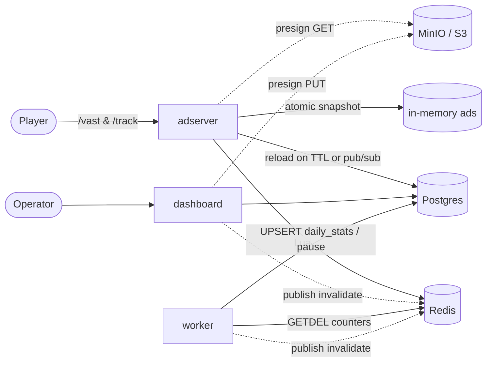

# OpenAdSource

**A self-hosted video ad server. VAST 4.2, budget + frequency caps,
GeoIP + device targeting, signed tracking pixels, a Next.js dashboard,
and a single `docker compose up` to run it all.**

[](https://github.com/eliau2005/openadsource/actions/workflows/ci.yml)
[](https://github.com/eliau2005/openadsource/actions/workflows/codeql.yml)
[](./LICENSE)

OpenAdSource is the ad server you can read in an afternoon and run on
a single VM. It serves real VAST 4.2 to any compliant player, enforces
budgets + frequency caps atomically in Redis, and stays out of your way
otherwise. Two Go binaries, one Next.js app, and the usual data-plane
backstops — Postgres, Redis, and an S3-compatible store.

---

## 60-second quickstart

```bash
git clone https://github.com/eliau2005/openadsource
cd openadsource
cp .env.example .env
docker compose up --build -d
```

Wait ~30 s for the one-shot `migrate` service to finish, then:

| What             | Where                                |
|------------------|--------------------------------------|
| Adserver         | <http://localhost:8088/healthz>      |
| Dashboard        | <http://localhost:3000>              |
| Test player      | <http://localhost:8090>              |
| MinIO console    | <http://localhost:9001>              |
| Adserver metrics | <http://localhost:8088/metrics>      |
| Worker metrics   | <http://localhost:9100/metrics> (dev overlay) |

Create the first dashboard user at <http://localhost:3000/setup>. To
seed a demo campaign with a working ad:

```bash
docker compose --profile seed up seed
```

Hammer the adserver:

```bash
curl -s 'http://localhost:8088/vast?pos=pre' | xmllint --format -
```

---

## Features

- **VAST 4.2 InLine** responses with one `<Linear>` creative,
  `<MediaFile>`, full quartile + click tracking
- **Hot-path zero Postgres reads** — the active-ad universe lives in
  process memory behind an `atomic.Pointer`; the snapshot reloads on a
  30 s ticker and on dashboard-initiated Redis pub/sub invalidations
- **Bitset-based ad selection** (hand-rolled `[]uint64` sets,
  intersect-into a sync.Pool scratch) — **2264 ns/op, 0 allocs/op**
- **Atomic budget + frequency capping** via Redis Lua (EVALSHA) — one
  round trip, never over-counts
- **Signed tracking pixels** — HMAC-SHA256 over `(ad_id, imp_id, event,
  exp)`, idempotency per `(imp_id, event)` for 24 h
- **GeoIP + UA targeting** — country (MaxMind GeoLite2-Country), device
  class (desktop / mobile / ctv / tablet), position (pre / mid / post)
- **Reconciler worker** drains Redis counters into Postgres
  `daily_stats` via `GETDEL`, pauses campaigns that have spent total
  budget — multi-replica safe via a Redis distributed lock
- **Per-IP rate limiting** on `/vast` and `/track` (`golang.org/x/time/rate`),
  no-fill / GIF over-limit responses — players never see a 429
- **Prometheus `/metrics`** on both the adserver and the worker, full
  `oas_*` collector catalog
- **Dashboard**: campaign + ad CRUD, presigned uploads to MinIO,
  funnel + daily-bar reports
- **Single command** to run the whole stack — `docker compose up`

---

## Phase status

OpenAdSource shipped in five phases. All are complete in v1.0.

| Phase | Deliverable                                                    |
|-------|----------------------------------------------------------------|
| 0     | Repo bootstrap, compose skeleton, CI, codeql, golangci-lint    |
| 1     | Schema, seed, S3 resolver, BYO + internal_s3 creatives         |
| 2     | Dashboard: auth, campaign/ad CRUD, Drizzle ORM, presigned uploads |
| 3     | Decision engine: registry, selection, freq + budget capping    |
| 4     | Tracking + worker: signed pixels, dedupe, GETDEL drain, /reports |
| 5     | Hardening: rate limit, /metrics, docs, GoReleaser, dependabot  |

See [ROADMAP.md](./ROADMAP.md) for the phase-by-phase design.

---

## Architecture at a glance



Full version with sequence diagrams and design rationale:
[`docs/architecture.md`](./docs/architecture.md).

---

## Documentation

| Doc                                                                    | Audience                                |
|------------------------------------------------------------------------|-----------------------------------------|
| [`docs/architecture.md`](./docs/architecture.md)                       | Engineers — system overview + internals |
| [`docs/self-hosting.md`](./docs/self-hosting.md)                       | Ops — env vars, TLS, backups, scaling   |
| [`docs/vast-integration.md`](./docs/vast-integration.md)               | Frontend — video.js / JW / IMA / hls.js |
| [`docs/api.md`](./docs/api.md)                                         | Anyone consuming the HTTP contract      |

For the in-browser test rig, see
[`examples/test-player`](./examples/test-player).

---

## Tech stack

- Go 1.25 — chi v5, pgx/v5, go-redis/v9, zerolog, golang-migrate, prometheus/client_golang
- Next.js 16 — React 19, Tailwind v4, Drizzle ORM, jose, bcryptjs
- Postgres 16, Redis 7, MinIO
- VAST 4.2 emission via `encoding/xml` with `,cdata` URL fields
- Multi-arch Docker images (`linux/amd64`, `linux/arm64`) published to
  GHCR on tag push

---

## Project layout

```
server/        Go adserver + worker + one-shot seed
dashboard/     Next.js dashboard (campaign CRUD, reports)
examples/      Static test player (video.js + videojs-vast-vpaid)
docs/          Architecture, self-hosting, VAST integration, API
.github/       CI, CodeQL, Dependabot, release workflow
docker-compose.yml         production-ish compose
docker-compose.dev.yml     development overlay
ROADMAP.md                 phase-by-phase design history
CHANGELOG.md               Keep-a-Changelog release notes
```

---

## Contributing

Issues and PRs are welcome.

The repository ships **empty** `CONTRIBUTING.md`, `CODE_OF_CONDUCT.md`,
`SECURITY.md`, and `LICENSE` files — the file paths exist (so GitHub's
sidebar links work) but the canonical text needs to be pasted in by
hand before publishing a release:

- `LICENSE` — Apache 2.0 (the project's intended license)
- `CODE_OF_CONDUCT.md` — Contributor Covenant 2.1
- `CONTRIBUTING.md` — typical Go + Next.js workflow notes
- `SECURITY.md` — disclosure address + supported-version table

This intentional gap is a Phase 5 carry-over; the v1.1 milestone will
publish a "first-publish checklist" with templates for each.

For now, when reporting a security issue, please email the address you
add to `SECURITY.md` — do not open a public issue.

---

## License

Apache 2.0 (intended). See [`LICENSE`](./LICENSE) — currently empty,
paste the canonical Apache 2.0 text before publishing.
