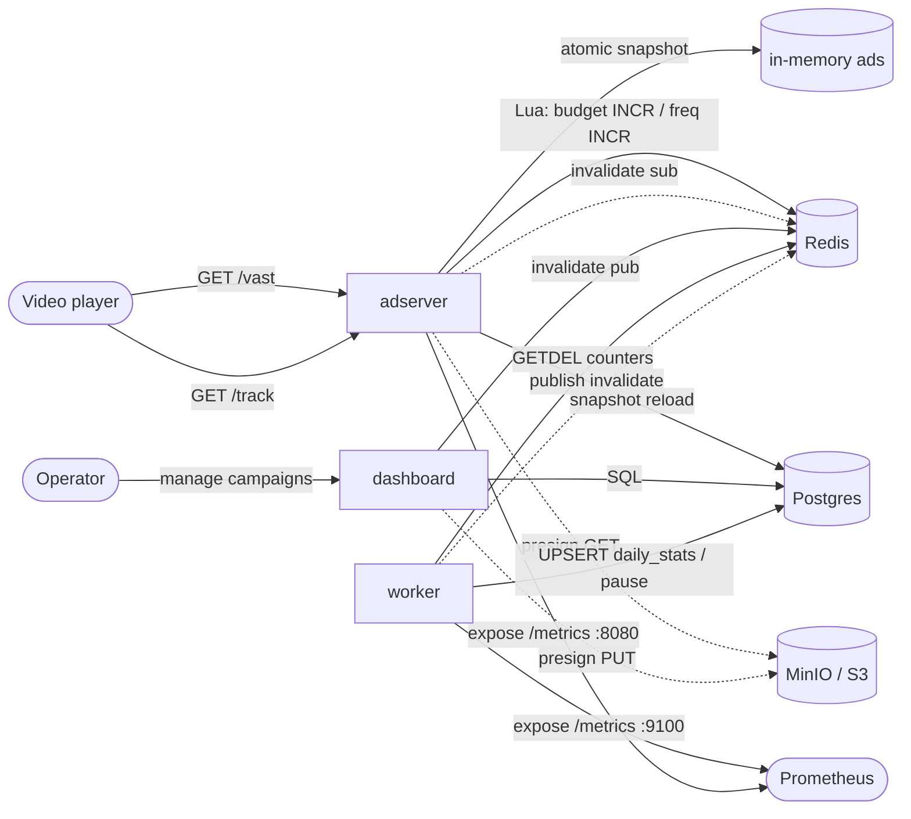
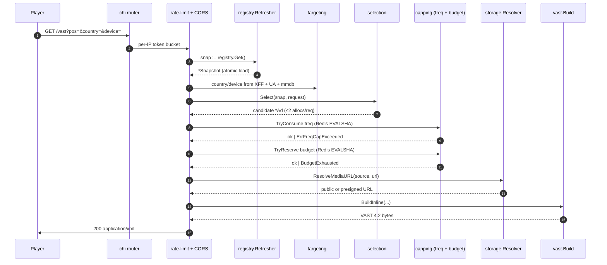
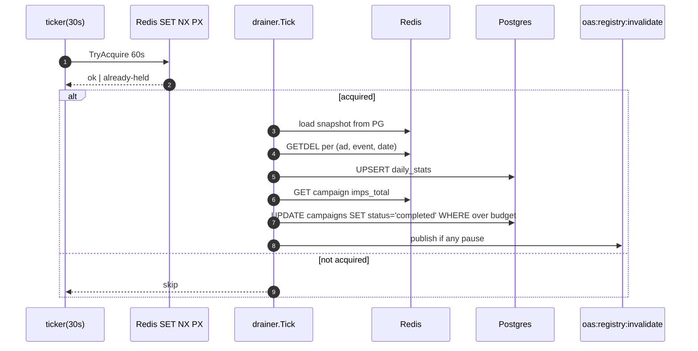

# Architecture

OpenAdSource is a self-hosted video ad server. Two Go binaries (the
**adserver** and the **worker**) sit in front of Postgres + Redis,
optional MinIO for creative hosting, and a Next.js **dashboard** for
campaign management. The adserver answers `GET /vast` and `GET /track`;
the worker drains tracking counters into a reporting table; the
dashboard reads + writes the campaign catalog.

This document is the system-wide tour: services, data flow, the
in-memory model the hot path relies on, and the failure modes you
should know about before running this in production.

---

## TL;DR

- `/vast` is served from a Go process with **zero Postgres reads on the
  hot path** and **at most one Redis round-trip** (the budget Lua
  script). The whole snapshot of active ads lives in process memory and
  is swapped atomically every 30 s or on a pub/sub invalidation.
- `/track` is the signed pixel endpoint. Each pixel URL carries an
  HMAC-SHA256 signature over `(ad_id, imp_id, event, exp)` so captured
  URLs can't be replayed for a different event. Events are deduped per
  `(imp_id, event)` in Redis with a 24 h TTL.
- A background worker reads + clears Redis counters with `GETDEL`,
  upserts them into Postgres `daily_stats`, and pauses campaigns whose
  total budget has been spent.
- Snapshots are reloaded both on a TTL ticker and on a Redis pub/sub
  invalidation that the dashboard fires whenever it edits the catalog,
  so dashboard changes are visible to the running adserver within
  milliseconds.

---

## Service map



| Service    | Binary / image                          | Port (default) | Purpose                                                 |
|------------|-----------------------------------------|----------------|---------------------------------------------------------|
| adserver   | `server/cmd/adserver`                   | 8080 → 8088    | Hot path: `/vast`, `/track`, `/healthz`, `/metrics`     |
| worker     | `server/cmd/worker`                     | 9100 (metrics) | Drain counters, pause completed campaigns               |
| dashboard  | `dashboard` (Next.js)                   | 3000           | Auth, CRUD on campaigns/ads, reports                    |
| postgres   | `postgres:16-alpine`                    | 5432           | Durable catalog + `daily_stats`                         |
| redis      | `redis:7-alpine`                        | 6379           | Counters, dedupe, dist lock, pub/sub                    |
| minio      | `minio/minio` (optional)                | 9000 / 9001    | S3-compatible creative storage                          |
| migrate    | `migrate/migrate` (one-shot)            | -              | Runs `server/migrations/*.sql` on startup               |
| seed       | `server/cmd/seed` (one-shot, profile)   | -              | Seeds a demo campaign + sample MP4 for local smoke tests|

The adserver and worker are statelessly scalable. Postgres and Redis are
the bottlenecks; everything else is replaceable.

---

## The `/vast` hot path

For every request, the adserver does this and nothing else:



A few things deliberately do not happen on this path:

- **No `SELECT`.** The snapshot is the only source of campaign data the
  hot path sees. Reads are an `atomic.Pointer[Snapshot].Load()` plus
  pre-computed bitset intersections.
- **No allocation per request beyond a `selection.Scratch`** pulled
  from a `sync.Pool` and a single `*Ad` return. Bench:
  `BenchmarkSelect-N` measures **2264 ns/op, 0 allocs/op** on
  commodity hardware.
- **No Redis call** when frequency capping is unconfigured for the
  candidate or when budgets are unconstrained.

Failure modes always emit a syntactically valid empty VAST (the player
sees a natural "no-fill"), never a 5xx — chi's `Recoverer` is the last
line of defence behind the explicit `h.writeEmpty(w)` branches.

---

## The snapshot

`server/internal/registry/snapshot.go` defines the immutable
data-structure swapped under `atomic.Pointer`:

```go
type Snapshot struct {
    Ads        []*Ad
    ByID       map[uuid.UUID]*Ad

    // Pre-computed bitsets for targeting indices — one bit per ad slot.
    ByPosition map[string]*bitset.Bitset
    ByCountry  map[string]*bitset.Bitset
    ByDevice   map[string]*bitset.Bitset
    Global     *bitset.Bitset
}
```

`bitset` is hand-rolled (`[]uint64` + `Set / Get / IntersectInto`) — no
dependency, no per-op heap allocations.

The `Refresher` keeps the live pointer fresh:

1. **TTL ticker** every `REGISTRY_REFRESH_INTERVAL` (default 30 s).
2. **Redis pub/sub** on the `oas:registry:invalidate` channel; the
   dashboard publishes here whenever it commits an INSERT/UPDATE/DELETE
   on `campaigns`, `ads`, `targeting`, or `cap_rules`. The worker
   publishes here too when it pauses a campaign on budget exhaustion.
3. **Fail-open**: a reload error keeps the previous snapshot — a
   transient Postgres hiccup does not break serving.

Selection itself is bitset arithmetic: intersect the position / country
/ device sets with the `Global` (filters expired / draft / paused
campaigns) and pick the first set bit with a deterministic offset
(`?offset=N`) for repeatable rotation across consecutive requests from
the same player.

---

## Tracking + counters

Every `<Impression>`, `<ClickThrough>`, and quartile URL emitted in the
VAST response carries a signed query string:

```
/track?event=impression&ad_id=<uuid>&imp_id=<uuid>&exp=<unix>&sig=<hmac>
```

`sig = HMAC_SHA256(TRACKING_SECRET, "ad_id|imp_id|event|exp")` —
truncated to 32 hex chars. `exp` defaults to `now + 24 h`. The handler:

1. Verifies the signature (constant-time compare).
2. Issues `SETNX track:<imp_id>:<event> 1 EX 86400`; if already set,
   silently returns the GIF — duplicate fire deduplicated.
3. INCRs the rolling daily counter
   `ad:<ad_id>:event:<event>:<YYYY-MM-DD>`.
4. Returns a 1×1 transparent GIF89a. Any failure branch also returns
   the GIF; the response status is the only side channel.

Per-campaign impression totals (`campaign:<id>:imps_total`) are
maintained by the freq + budget enforcers separately so the worker can
reconcile budgets without scanning per-ad keys.

---

## The worker

`server/cmd/worker/main.go` runs an interval-driven loop:



`GETDEL` is the keystone: it returns the current value and deletes the
key in one round trip, so counters can never be double-counted across
ticks even if the worker dies between read and delete. The Redis lock
(`SET NX PX 60000` + Lua compare-delete release) makes the loop
safe to run with N>1 replicas — exactly one drainer runs per tick.

`datesToDrain` returns today + yesterday (UTC) to absorb time-zone
boundary races; older days have already been drained and are
immutable in `daily_stats`.

---

## Memory + allocation discipline

The hot path is optimised assuming serving rates from O(1k req/s)
upwards. The choices that pay for themselves:

| Concern             | Choice                                                  | Cost                              |
|---------------------|---------------------------------------------------------|-----------------------------------|
| Snapshot read       | `atomic.Pointer[Snapshot].Load()`                       | ~1 ns, lock-free                  |
| Targeting filter    | Hand-rolled `[]uint64` bitsets, pre-computed at load    | O(N/64) per intersect, 0 allocs   |
| Selection scratch   | `sync.Pool` of `*Scratch` (the intersect buffer)        | 0 allocs steady-state             |
| Capping             | Redis Lua via `EVALSHA` (atomic INCR + check)           | 1 RTT, no Redis client GC churn   |
| VAST encoding       | `encoding/xml` with `,cdata` on URLs                    | One `bytes.Buffer` per response   |
| Tracking GIF        | Single `[]byte{...}` package var, served as-is          | Zero allocs per pixel             |

Benchmark numbers in
`server/internal/selection/select_bench_test.go` and
`server/internal/registry/refresher_bench_test.go`.

---

## Failure modes

| What breaks                | What the adserver does                                |
|----------------------------|--------------------------------------------------------|
| Postgres unreachable       | Snapshot reload fails; previous snapshot keeps serving |
| Redis unreachable          | Budget + freq enforcers act as no-op stubs (allow)     |
| `GEOIP_DB_PATH` missing    | `country = ""`; targeting rule that requires country fails to match |
| Cookie missing             | Fresh UUID minted, set via `Set-Cookie` on the response|
| `TRACKING_SECRET` empty    | `/track` signer is nil; signatures skipped (dev only)  |
| MinIO unreachable          | `internal_s3` ads' `ResolveMediaURL` fails → no-fill   |
| Worker dies mid-tick       | Lock TTL expires (60 s); next tick re-runs idempotently|
| Worker partition           | Postgres + Redis disagree; next tick reconciles        |

A 5xx from `/vast` is a bug, not a normal outcome. Anything that would
have produced one is caught by the `writeEmpty` branch or by chi's
`Recoverer`.

---

## File layout (top level)

```
server/
├── cmd/
│   ├── adserver/    HTTP listener, chi router, signal handling
│   ├── worker/      Tick loop, lock acquire, drain
│   └── seed/        One-shot demo seeder (compose profile=seed)
├── internal/
│   ├── capping/     Redis Lua scripts + enforcer types
│   ├── config/      Env-driven Config struct
│   ├── db/          pgxpool helpers (NewPool, PingWithRetry)
│   ├── delivery/    /vast handler — composes everything below
│   ├── httpmw/      cors, ratelimit, metrics middleware
│   ├── metrics/     Prometheus collectors + Handler()
│   ├── registry/    Snapshot model + Refresher (atomic + pubsub)
│   ├── selection/   Bitset-based ad picker + Scratch sync.Pool
│   ├── storage/     S3 presigner + external_url passthrough
│   ├── targeting/   IP resolver, GeoIP, UA classifier, device norm
│   ├── tracking/    Signer, /track handler, cookie helpers, events
│   ├── vast/        VAST 4.2 XML builder (encoding/xml + ,cdata)
│   └── worker/      Lock + Drainer (used by cmd/worker)
└── migrations/      SQL migrations (golang-migrate)

dashboard/
├── app/             Next.js 16 app router pages + API routes
├── components/      shadcn-style UI primitives
├── lib/             session, presign, db client (Drizzle)
└── drizzle/         Schema + migrations (kept in sync with server)

examples/test-player/  Static HTML test player (video.js)
docs/                  This directory
```

See `docs/self-hosting.md` for the operator's perspective,
`docs/vast-integration.md` for player-side integration, and
`docs/api.md` for the formal HTTP contracts.
